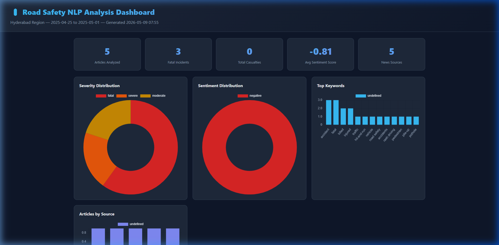
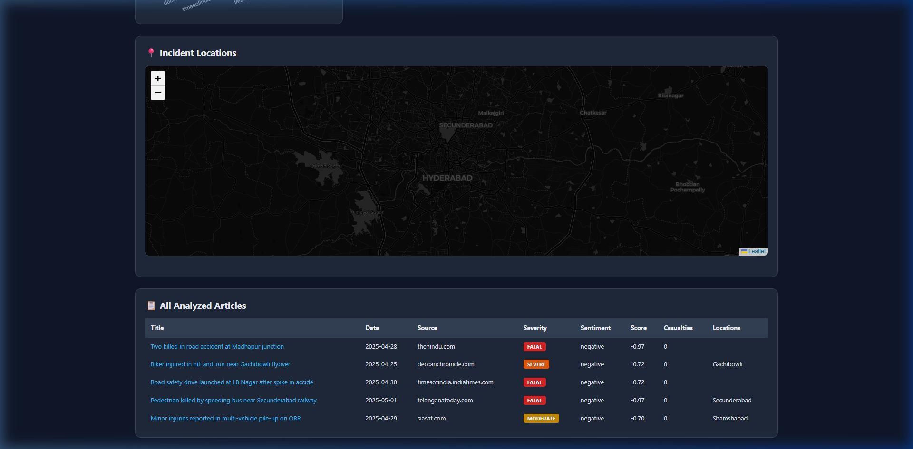

# 🚦 Road Safety NLP Analysis System

**Natural Language Processing for the Classification of Severity of Road Accidents from Social Media & News Articles — Hyderabad, India**

> **Design Project (EEE F376)** — Birla Institute of Technology and Science, Pilani — Hyderabad Campus  
> **Under the supervision of** Prof. Bandhan Majumdar  (majumdar@hyderabad.bits-pilani.ac.in)
> **By** Harshal Bhambhani (ID: 2022A3PS1809H)

---

## 📌 Table of Contents

- [Need for Study](#-need-for-study)
- [Work Progress & Evolution](#-work-progress--evolution)
  - [Phase 1: Twitter API Approach](#phase-1-twitter-api-approach-abandoned)
  - [Phase 2: Twitter Scraping via Nitter](#phase-2-twitter-scraping-via-nitter-partially-successful)
  - [Phase 3: YouTube Comments Scraping](#phase-3-youtube-comments-scraping-abandoned)
  - [Phase 4: News Article Scraping (Final)](#phase-4-news-article-scraping-final-approach-)
- [Problems Encountered & Lessons Learned](#-problems-encountered--lessons-learned)
- [Final System Architecture](#-final-system-architecture)
- [Module Breakdown](#-module-breakdown)
- [NLP Pipeline](#-nlp-pipeline)
- [Quick Start](#-quick-start)
- [Features](#-features)
- [Demo Results](#-demo-results)
- [Output](#-output)
- [Configuration](#️-configuration)
- [References](#-references)

---

## 📖 Need for Study

Road safety is an alarming global concern, with millions of fatalities occurring annually, leading to severe injuries and deaths. Traditional media reporting on road safety often lacks **real-time public sentiment** and suffers from delays. Social media platforms like Twitter, Facebook, and Reddit have introduced new avenues for gathering immediate information about road accidents and public opinions.

**AI and NLP** offer powerful tools to analyze this unstructured data, enabling:

- **Real-time accident detection** from social media/news text
- **Sentiment analysis** of public perception toward road safety measures
- **Identification of high-risk locations** through Named Entity Recognition (NER)
- **Prediction of accident trends** based on time, location, and contributing factors (speeding, poor infrastructure, drunk driving)
- **Severity classification** (Fatal / Severe / Moderate / Minor) to prioritize emergency response

The findings can help authorities and researchers develop **proactive measures for accident prevention** and improved traffic management, particularly in Hyderabad — one of India's fastest-growing metropolitan areas.

---

## 🔄 Work Progress & Evolution

This project went through **four distinct phases** of trial and error before arriving at the final optimized approach. Each phase revealed critical limitations that informed the next iteration.

### Phase 1: Twitter API Approach (❌ Abandoned)

**Idea:** Use the Twitter API (via `tweepy`) to collect tweets related to road safety in Hyderabad in real-time.

```python
# Original approach (from Untitled17.ipynb)
import tweepy

auth = tweepy.OAuthHandler(consumer_key, consumer_secret)
api = tweepy.API(auth, wait_on_rate_limit=True)

for keyword in ["road safety", "crashes", "accidents", "#RoadSafety"]:
    for tweet in tweepy.Cursor(api.search_tweets, q=keyword, lang="en",
                               tweet_mode="extended").items(1000):
        tweets_data.append([tweet.full_text, tweet.created_at, tweet.user.location])
```

**Why it was chosen initially:**
- Twitter offers geo-tagging, public tweets, hashtags, and developer-friendly APIs
- Real-time data with engagement metrics (retweets, likes)
- Well-documented Python libraries (`tweepy`)

**Why it failed:**
- **Post-2023 API restrictions**: Twitter (now X) drastically changed its API policies, making free-tier access extremely limited
- **Cost barrier**: The Basic API tier ($100/month) only allows 10,000 tweets/month — insufficient for research
- **No free search endpoint**: The free tier only allows tweet posting, not searching/reading
- **Developer account approval delays**: Getting elevated access became increasingly difficult

**Key Learning:** Relying on a single commercial API for academic research is risky due to policy changes.

---

### Phase 2: Twitter Scraping via Nitter (⚠️ Partially Successful)

**Idea:** Bypass Twitter API restrictions by scraping tweets through Nitter — an open-source Twitter frontend that doesn't require authentication.

```python
# Approach (from Twitter_Web_Scraping.ipynb)
from ntscraper import Nitter

scraper = Nitter(0)  # Auto-select working instance
tweets = scraper.get_tweets("RoadSafety", mode='hashtag', number=100)

for tweet in tweets['tweets']:
    data = [tweet['link'], tweet['text'], tweet['date'],
            tweet['stats']['likes'], tweet['stats']['comments']]
```

**What worked:**
- Successfully scraped tweets by hashtag and by user
- Retrieved profile information (followers, bio, etc.)
- No API keys or authentication required
- Data structured into DataFrames with link, text, date, likes, comments

**Why it was ultimately insufficient:**
- **Instance instability**: Nitter instances frequently go offline; Twitter actively blocks them
- **Rate limiting**: Most instances impose their own rate limits
- **No geo-filtering**: Can't filter tweets by location — critical for Hyderabad-specific analysis
- **Data quality**: No guarantee of completeness; results vary by instance
- **Legal grey area**: Web scraping Twitter violates their Terms of Service

**Key Learning:** Scraping workarounds are fragile and unreliable for consistent academic research.

---

### Phase 3: YouTube Comments Scraping (❌ Abandoned)

**Idea:** Use YouTube comments as an alternative to tweets, since comments under road accident videos tend to be dynamic and sentimental.

**Implementation:**
- Generated a free YouTube Data API key via Google Cloud Console
- Used YouTube Data API v3 to search for Hyderabad road safety videos
- Scraped comments from relevant videos using keyword filtering

**Why it failed:**

| Problem | Impact |
|---------|--------|
| **Limited API quota** | 10,000 units/day. Searching costs 100 units, each comment thread costs 1 unit — can only process ~100 videos/day |
| **Language variations** | Comments in Hindi, Telugu, or slang ("aksident", "raod saftee") bypass keyword filters |
| **No geo-filtering on comments** | YouTube doesn't provide commenter location — can't verify if they're from Hyderabad |
| **Low relevance** | Many comments are reactions to video content, not eyewitness accounts |
| **Noise** | Comments often include jokes, arguments, and off-topic discussions |

**Key Learning:** Social media comments lack the structured, verified information needed for reliable accident analysis.

---

### Phase 4: News Article Scraping (✅ Final Approach)

**Idea:** Scrape and analyze news articles from established Indian news outlets. News articles provide verified, structured, and location-specific reporting on road accidents.

```python
# Final approach (from WebScraper.ipynb, now modularized)
from newspaper import Article
from bs4 import BeautifulSoup
import spacy

# Crawl news sources → extract articles → NLP analysis
scraper = NewsArticleScraper()
articles = scraper.scrape_all()  # 8+ sources, keyword-filtered
```

**Why this is the optimal approach:**

| Advantage | Explanation |
|-----------|-------------|
| **Verified information** | News articles are fact-checked and follow editorial guidelines — far less noise than social media |
| **Structured language** | Journalistic writing is well-structured, making NLP parsing more accurate for extracting events, entities, and cause-effect relationships |
| **Rich detail** | Articles include dates, locations, victim count, vehicle types, official statements, and statistics |
| **Historical depth** | News archives span years, enabling trend analysis over time (e.g., sentiment shifts after helmet law enforcement) |
| **Geographic relevance** | Local publications (The Hindu, Deccan Chronicle, Telangana Today) focus specifically on Hyderabad and Telangana |
| **No API restrictions** | News websites are publicly accessible with standard HTTP requests |
| **Legal compliance** | Scraping publicly available news content for academic research is generally permissible |

**News sources used:**
1. The Hindu — Hyderabad edition
2. Times of India — Hyderabad
3. Deccan Chronicle
4. Telangana Today
5. The News Minute — Telangana
6. The Siasat Daily
7. Hindustan Times — Hyderabad
8. India Herald

---

## ⚠️ Problems Encountered & Lessons Learned

Throughout the project, several cross-cutting challenges were identified:

| Challenge | Description | Solution Implemented |
|-----------|-------------|---------------------|
| **Geo-tag scarcity** | Not all social media users enable geotags | Used SpaCy NER to extract location names from text + Nominatim geocoding |
| **Colloquial location references** | Tweets/comments say "near the mall" instead of proper addresses | NER combined with contextual location databases |
| **Data noise** | False positives when keywords appear in unrelated contexts | Multi-keyword filtering + severity keyword matching for validation |
| **Multi-language content** | Regional languages (Hindi, Telugu) in tweets/comments | Focused on English-language news articles which are consistently structured |
| **API policy changes** | Twitter's 2023 API overhaul broke the original approach | Pivoted through 3 alternatives before settling on news scraping |
| **Rate limiting** | All APIs and websites impose request limits | Implemented polite delays (1-3s between requests) and caching for geocoding |
| **Encoding issues** | Unicode emojis in output on Windows terminals | Set `PYTHONIOENCODING=utf-8` for proper rendering |

---

## 🏗 Final System Architecture

```
social_media_scrapper/
│
├── config/
│   └── settings.py              # Central configuration (keywords, sources, thresholds)
│
├── scrapers/
│   ├── news_scraper.py          # Primary: News article scraper (8+ sources)
│   └── twitter_scraper.py       # Secondary: Twitter/Nitter scraper (optional fallback)
│
├── nlp/
│   ├── preprocessor.py          # Text cleaning (URLs, mentions, stopwords, lemmatization)
│   ├── sentiment.py             # VADER sentiment analysis
│   ├── ner.py                   # SpaCy Named Entity Recognition (locations)
│   └── classifier.py            # Severity classification (Fatal/Severe/Moderate/Minor)
│
├── geo/
│   └── geocoder.py              # Nominatim geocoding with caching
│
├── data/
│   └── storage.py               # CSV + JSON persistence layer
│
├── visualization/
│   └── dashboard.py             # Interactive HTML dashboard (Chart.js + Leaflet)
│
├── output/                      # Generated results (gitignored)
├── screenshots/                 # Dashboard preview images
├── main.py                      # CLI entry point
├── requirements.txt             # Python dependencies
│
├── WebSraper.ipynb              # Original prototype: News scraping
├── Untitled17 (1).ipynb         # Original prototype: Twitter API + VADER
├── Twitter_Web_Scraping (1).ipynb  # Original prototype: Nitter scraping
├── MidTerm_report_Format.a.0 (1).docx   # Mid-term progress report
└── Final_report_Format_Compre[1] (1).docx  # Final comprehensive report
```

### Data Flow

```
┌──────────────────┐     ┌──────────────────┐     ┌──────────────────┐
│   NEWS SOURCES   │     │   TEXT CLEANING   │     │   NLP ANALYSIS   │
│                  │     │                  │     │                  │
│ • The Hindu      │────▶│ • Remove URLs    │────▶│ • VADER Sentiment│
│ • Times of India │     │ • Remove mentions│     │ • SpaCy NER      │
│ • Deccan Chron.  │     │ • Stopwords      │     │ • Severity       │
│ • Telangana Today│     │ • Lemmatization  │     │   Classification │
│ • 4 more sources │     │                  │     │ • Casualty Count │
└──────────────────┘     └──────────────────┘     └──────────────────┘
                                                          │
                                                          ▼
                         ┌──────────────────┐     ┌──────────────────┐
                         │   DASHBOARD      │     │   GEOCODING      │
                         │                  │◀────│                  │
                         │ • Chart.js charts│     │ • Nominatim API  │
                         │ • Leaflet map    │     │ • Result caching │
                         │ • Data table     │     │ • Rate limiting  │
                         │ • HTML export    │     │                  │
                         └──────────────────┘     └──────────────────┘
```

---

## 📦 Module Breakdown

### `config/settings.py` — Central Configuration

All tunable parameters in one place:
- **30+ road safety keywords**: accident, fatal, crash, hit-and-run, drunk driving, pothole, etc.
- **Severity keyword dictionaries**: 4 levels (Fatal, Severe, Moderate, Minor) with 10+ keywords each
- **8 news sources** with configurable pagination limits
- **Polite scraping delays** (1-3 seconds between requests)

### `scrapers/news_scraper.py` — News Article Scraper

- Crawls up to 10 pages per source using `BeautifulSoup`
- Filters links by keyword + city relevance
- Extracts full article content using `newspaper3k` (title, text, date, authors)
- Deduplicates URLs automatically
- Includes progress reporting via callback

### `scrapers/twitter_scraper.py` — Twitter Scraper (Optional)

- Uses `ntscraper` (Nitter) — no API keys needed
- Searches by hashtag or username
- Graceful fallback: returns empty results if Nitter is unavailable
- Kept as supplementary source for future use

### `nlp/preprocessor.py` — Text Preprocessing

- URL, @mention, and #hashtag symbol removal
- Stopword removal (with domain-specific exceptions like "not", "no", "very")
- WordNet lemmatization
- NLTK sentence tokenization
- Two modes: `clean()` for display, `clean_for_analysis()` for ML

### `nlp/sentiment.py` — Sentiment Analysis

- **VADER** (Valence Aware Dictionary and sEntiment Reasoner)
- Returns compound score (-1.0 to +1.0) and categorical label (positive/negative/neutral)
- Particularly suited for news and social media text
- Batch analysis support

### `nlp/ner.py` — Named Entity Recognition

- **SpaCy** with `en_core_web_sm` model
- Extracts GPE (geopolitical), LOC (location), and FAC (facility) entities
- Filters out generic locations (Hyderabad, India, Telangana) to focus on specific incident sites
- Returns unique location names per article

### `nlp/classifier.py` — Severity Classification

Four-level classification system:

| Level | Example Keywords |
|-------|-----------------|
| **Fatal** | killed, death, deceased, fatal, died, succumbed, spot dead, casualty |
| **Severe** | critical, grievous, ICU, fracture, head injury, surgery, coma, ventilator |
| **Moderate** | injured, hurt, wound, treatment, bleeding, sprain, dislocation |
| **Minor** | damage, dent, scratch, near miss, narrow escape, property damage |

Additionally extracts **casualty counts** from text — handles both digit forms ("3 killed") and word forms ("two people died").

### `geo/geocoder.py` — Geocoding

- **Nominatim** (OpenStreetMap) geocoding
- Caches results to avoid duplicate API calls
- Respects rate limits (1 request/second)
- Contextual queries: appends "Hyderabad, India" for better accuracy

### `visualization/dashboard.py` — Interactive Dashboard

Generates a **self-contained HTML file** (no server needed) with:
- **Stat cards**: total articles, fatal incidents, casualties, avg sentiment
- **Doughnut charts**: severity distribution, sentiment distribution
- **Bar charts**: top keywords frequency, articles by source
- **Leaflet map**: incident locations plotted on Hyderabad map with color-coded severity pins
- **Data table**: all articles with clickable links, severity badges, and sentiment scores

---

## 🧠 NLP Pipeline

Each article goes through the following pipeline:

```
Raw Article Text
      │
      ▼
┌─────────────┐
│ PREPROCESS  │  Remove URLs, mentions, normalize whitespace
└─────┬───────┘
      │
      ▼
┌─────────────┐
│ SENTIMENT   │  VADER → compound score + label (positive/negative/neutral)
└─────┬───────┘
      │
      ▼
┌─────────────┐
│ NER         │  SpaCy → extract location names (Madhapur, Gachibowli, LB Nagar...)
└─────┬───────┘
      │
      ▼
┌─────────────┐
│ CLASSIFY    │  Keyword matching → Fatal/Severe/Moderate/Minor + casualty count
└─────┬───────┘
      │
      ▼
┌─────────────┐
│ GEOCODE     │  Nominatim → latitude/longitude for map plotting
└─────┬───────┘
      │
      ▼
  CSV + JSON + Dashboard
```

---

## 🚀 Quick Start

### Prerequisites

- Python 3.9+
- pip

### Installation

```bash
# Clone the repository
git clone https://github.com/Harshaaalll/social_media_scrapper.git
cd social_media_scrapper

# Install dependencies
pip install -r requirements.txt

# Download SpaCy language model
python -m spacy download en_core_web_sm
```

### Usage

```bash
# Run demo with sample data (no network needed)
python main.py --demo

# Run full pipeline (scrapes live news articles)
python main.py

# Limit scraping depth (faster)
python main.py --max-pages 3

# Skip geocoding (faster, no map pins)
python main.py --no-geocoding

# Only scrape articles, skip NLP analysis
python main.py --scrape-only

# Analyze a previously saved JSON file
python main.py --analyze output/road_safety_analysis_20250509.json
```

> **Note (Windows):** If you see Unicode errors, set the encoding first:
> ```bash
> set PYTHONIOENCODING=utf-8
> python main.py --demo
> ```

---

## 📊 Features

| Feature | Description |
|---------|-------------|
| **Multi-source scraping** | 8+ Indian news sources (The Hindu, TOI, Deccan Chronicle, etc.) |
| **NLP Pipeline** | Clean → NER → Sentiment → Severity Classification |
| **Severity Classification** | Fatal / Severe / Moderate / Minor / Unclassified |
| **Sentiment Analysis** | VADER compound scores (-1 to +1) + categorical labels |
| **Location Extraction** | SpaCy NER + Nominatim geocoding to lat/lon |
| **Casualty Extraction** | Regex-based count extraction from both digits and word-form numbers |
| **Interactive Dashboard** | Self-contained HTML with Chart.js charts + Leaflet maps |
| **CLI Interface** | Configurable with `--demo`, `--scrape-only`, `--max-pages`, `--no-geocoding` |
| **Data Export** | CSV (for Excel/Pandas) + JSON (for programmatic use) |
| **Graceful Fallbacks** | Each module fails independently without crashing the pipeline |

---

## 📸 Demo Results

> Generated with `python main.py --demo` using sample road safety articles from Hyderabad.

### Dashboard Overview — Stat Cards, Severity & Sentiment Charts, Top Keywords



### Incident Map & Analyzed Articles Table



---

## 📈 Output

Each run generates three files in the `output/` folder:

| File | Format | Use Case |
|------|--------|----------|
| `road_safety_analysis_*.csv` | CSV | Open in Excel, import into Pandas for further analysis |
| `road_safety_analysis_*.json` | JSON | Programmatic access, nested structures preserved |
| `dashboard_*.html` | HTML | Open in any browser — fully self-contained, no server needed |

### CSV Schema

| Column | Description |
|--------|-------------|
| `title` | Article headline |
| `date` | Publication date (YYYY-MM-DD) |
| `source` | News outlet domain |
| `url` | Direct link to article |
| `authors` | Article author(s) |
| `keywords_found` | Road safety keywords matched |
| `locations` | Locations extracted via NER |
| `latitude` / `longitude` | Geocoded coordinates |
| `sentiment_compound` | VADER score (-1.0 to +1.0) |
| `sentiment_label` | positive / negative / neutral |
| `severity_level` | fatal / severe / moderate / minor / unclassified |
| `severity_confidence` | Classification confidence (0.0 to 1.0) |
| `casualty_count` | Extracted number of casualties |
| `cleaned_text` | Preprocessed text for analysis |

---

## ⚙️ Configuration

Edit `config/settings.py` to customize the system:

| Parameter | Default | Description |
|-----------|---------|-------------|
| `TARGET_CITY` | `"Hyderabad"` | City to focus on |
| `ROAD_SAFETY_KEYWORDS` | 30+ keywords | Terms for filtering relevant articles |
| `SEVERITY_KEYWORDS` | 4-level dict | Keywords for each severity level |
| `NEWS_SOURCES` | 8 URLs | News outlet base URLs to crawl |
| `MAX_PAGES_PER_SOURCE` | 10 | Pagination depth per source |
| `REQUEST_DELAY_MIN/MAX` | 1.0 / 3.0 sec | Polite scraping delay range |
| `SPACY_MODEL` | `"en_core_web_sm"` | SpaCy model for NER |
| `EXCLUDED_LOCATIONS` | generic names | Locations to skip in NER (e.g., "India") |

---

## 📚 References

1. [Reliability analysis using Twitter data](https://journals.sagepub.com/doi/10.1177/1748006X221140196) — SAGE Journals
2. [Incident Detection Using Data from Social Media](https://www.researchgate.net/publication/323786037) — ResearchGate
3. [Road Accident Analysis Using NLP](https://www.mdpi.com/2078-2489/13/1/26) — MDPI Information
4. [Social Media for Traffic Incident Detection](https://ieeexplore.ieee.org/document/8317967/) — IEEE
5. [Road Safety Analysis Using Machine Learning](https://www.mdpi.com/2624-8921/7/1/5) — MDPI Vehicles
6. [Sentiment Analysis for Road Safety Policies](https://www.researchgate.net/publication/390806678) — ResearchGate
7. [NLP Approaches for Accident Severity Classification](https://arxiv.org/pdf/2504.21025) — arXiv
8. [Text Mining in Road Safety Research](https://pmc.ncbi.nlm.nih.gov/articles/PMC9482885/) — PubMed Central

---

## 🛠 Tech Stack

| Category | Technologies |
|----------|-------------|
| **Language** | Python 3.9+ |
| **Web Scraping** | `requests`, `BeautifulSoup4`, `newspaper3k` |
| **NLP** | `spacy` (NER), `nltk` (preprocessing), `vaderSentiment` (sentiment) |
| **Geocoding** | `geopy` (Nominatim/OpenStreetMap) |
| **Visualization** | Chart.js, Leaflet.js (embedded in HTML) |
| **Data** | `pandas`, `csv`, `json` |
| **Twitter (optional)** | `ntscraper` (Nitter) |

---

*This project was developed as part of the Design Project course (EEE F376) at BITS Pilani, Hyderabad Campus, January–May 2025.*
